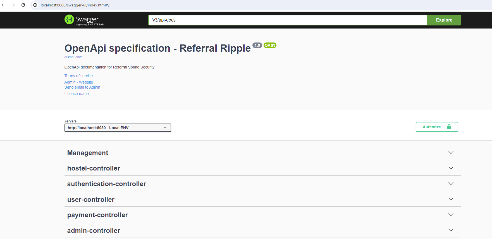

# User-Management-API

User management application created for base framework of User management. This application suitable for any application.

This application will have two default users like Admin & Manager. It also provides the API documentation. Kindly visit
the <a href="http://localhost:8080/swagger-ui/index.html">Open API Document</a> once application is up and running.



## High level hierarchy of User Management


<ol>
    <li>User can be associated with one or more hostel(s).</li>
    <li>One Hostel can have multiple rooms.</li>
    <li>One Room can have multiple tenants.</li>
    <li>One tenant can have multiple payments. Possibly monthly one payment.</li>
</ol>

## Technologies Used

<ul>
    <li>JDK - 17.x</li>
    <li>Spring boot - 3.x</li>
    <li>Maven 3.9.x</li>
    <li>MySQL - 8.x</li>
</ul>

MySQL user should be created with the credentials of root/root. If you have your own credentials, it needs to be updated
in **application.yml** file.

```dtd
spring:
  datasource:
    url: jdbc:mysql://localhost:3306/hostel
    username: root
    password: root
    driver-class-name: com.mysql.cj.jdbc.Driver
```

You should create the database with the name of hostel(it can be any name) in MySQL environment. if you want to create
with different name, it needs to be updated in the above url property.

## Docker deployment commands

1. Pull MYSQL image

```dockerfile
docker pull mysql
```

2. Create MySQL Container and Run

```dockerfile
docker run -p 3307:3306 --name mysqlcontainer -e MYSQL_ROOT_PASSWORD=MySQL123 -e MYSQL_DATABASE=hostel -d mysql
```

3. Create docker network for MySQL

```dockerfile
docker network create networkmysql
```

4. Connect MySQL network with MySQL container

```dockerfile
docker network connect networkmysql mysqlcontainer
```

5. Build spring-boot application image

```dockerfile
docker build -t hostel-api-image .
```

6. Create spring-boot application container and run it.

```dockerfile
docker run -p 8090:8080 --name hostel-api-container --net networkmysql -e MYSQL_HOST=mysqlcontainer -e MYSQL_PORT=3306 -e MYSQL_DB_NAME=hostel -e MYSQL_USER=root -e MYSQL_PASSWORD=MySQL123 hostel-api-image
```

## MySQL command to create database

```dtd
create database hostel
```

verify with the below command that the hostel database has been created or not

```dtd
show databases
```